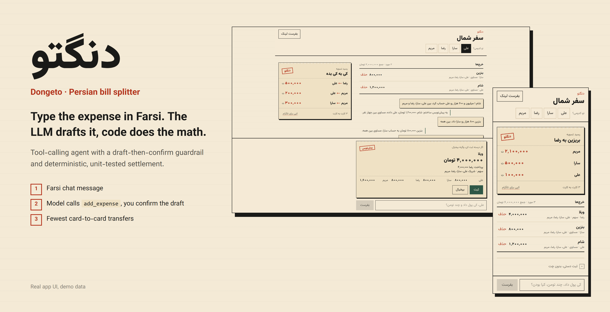
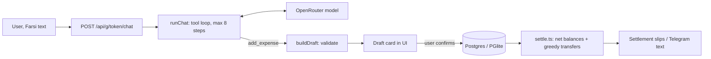
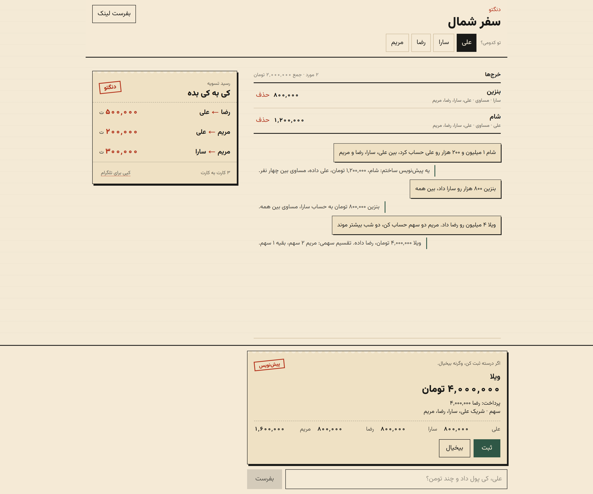
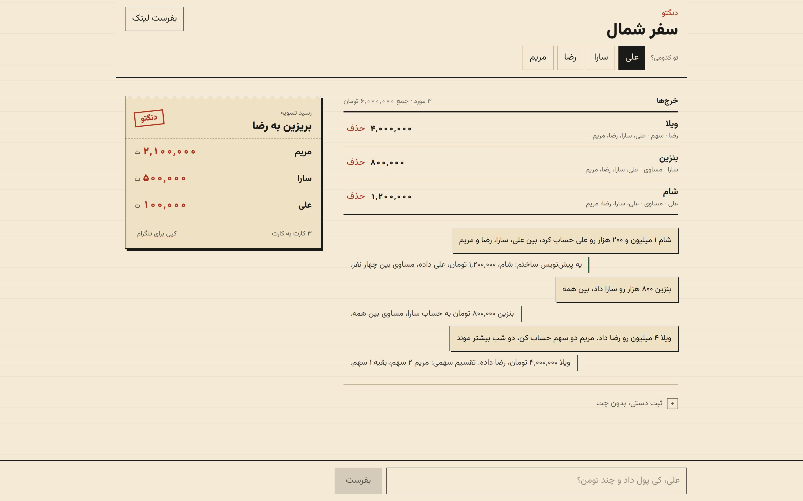
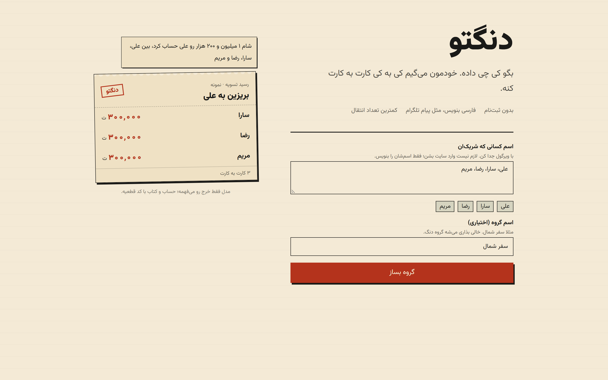
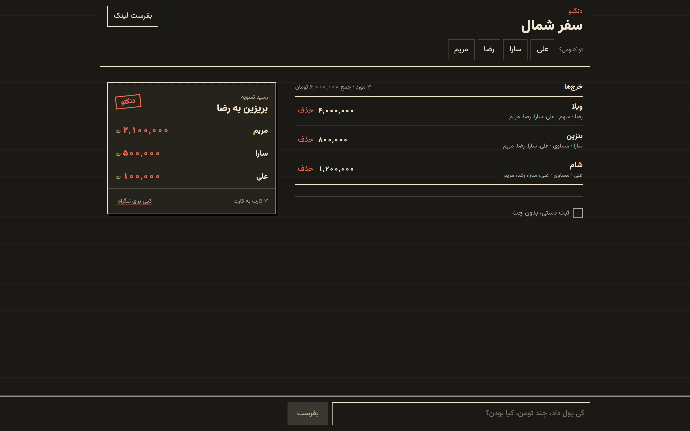
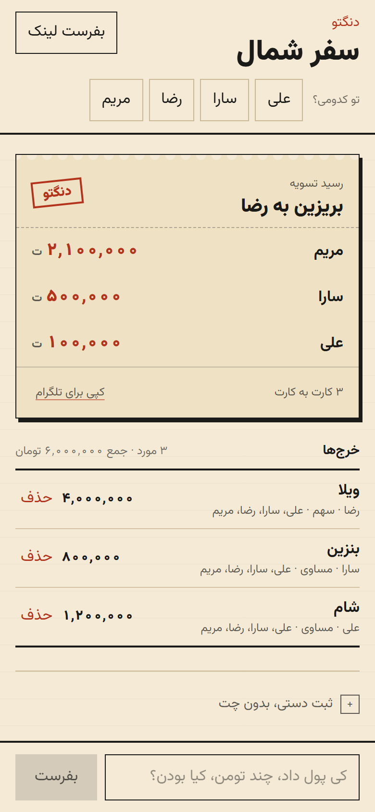

# Dongeto (دنگتو)



**Type the expense in Farsi. The LLM drafts it, code does the math.**


A Persian bill splitter: describe an expense in Farsi, the LLM drafts it, you confirm, and deterministic code works out who pays whom with the fewest transfers.

## Highlights

- **LLM as a parser, not a calculator:** the model only calls tools; all money math is integer toman in unit-tested code.
- **Human-in-the-loop:** every AI-built expense is a draft card, with each person's share already computed by the split engine, until you press ثبت.
- **Self-correcting tool loop:** tool errors go back to the model, up to 8 steps.
- **Persian-first UI:** RTL, Vazirmatn, Persian digits, `۴۵۰ هزار` / `4.5 میلیون` parsing, a "carbon copy" dark mode.
- **Zero setup:** no accounts, and a PGlite file DB when no Postgres is configured.

## Why it's interesting

- **The model never does math.** It only calls tools; amounts are integer toman, and splitting and settlement live in plain, unit-tested code (`lib/split.ts`, `lib/settle.ts`).
- **Draft-then-confirm.** The `add_expense` tool only builds and validates a draft (amount, split type, member names). Nothing is saved until the user confirms the card in the UI.
- **Tool-calling loop with feedback.** `runChat` in `lib/openrouter.ts` runs up to 8 steps; tool errors (for example an unknown member name) are returned to the model as tool results so it can correct itself, e.g. call `add_member` first.
- **Persian-first.** Farsi system prompt and tool descriptions, RTL UI (Vazirmatn), Persian digit and amount parsing (`۴۵۰ هزار`, `4.5 میلیون`) in `lib/money.ts`, and a Telegram-ready settlement text.
- **No accounts.** A group is a secret URL; people in it don't need to open the site.

## Example

Input (chat, Farsi):

```
شام ۱ میلیون و ۲۰۰ هزار رو علی حساب کرد، بین علی، سارا، رضا و مریم
```

The model calls `add_expense` with `amount_toman: 1200000`, `split_type: "equal"`, payer علی, and four shares of weight 1. A draft card appears; after you confirm, the engine settles (each share is 300,000 toman):

```
سارا ← علی    ۳۰۰٬۰۰۰ تومان
رضا ← علی    ۳۰۰٬۰۰۰ تومان
مریم ← علی   ۳۰۰٬۰۰۰ تومان
```

(Illustrative; the debtor is on the right, the arrow points toward the payee.) With many expenses, the greedy netting in `lib/settle.ts` produces at most n-1 transfers.

## Architecture



The chat route is rate limited (in-memory, per group token). Tools: `list_group`, `add_member`, `add_expense`, `explain_settlement`.

## Tech stack

Next.js 16 (App Router), React 19, Tailwind 4, Drizzle ORM with PGlite (file DB) or Postgres, OpenRouter via the `openai` SDK, `tsx --test` for tests.

## Key techniques

- Function calling with bounded steps and error feedback: `lib/openrouter.ts`
- Human-in-the-loop guardrail: `buildDraft` validation plus the confirm UI (`components/ConfirmDraft.tsx`)
- Split types (equal, exact, percent, shares): `lib/split.ts`
- Minimum-ish transfer settlement: `lib/settle.ts`
- Persian amount parsing and formatting: `lib/money.ts`

## Getting started

```bash
npm install
cp .env.example .env     # set OPENROUTER_API_KEY for chat
npm run dev
```

Open http://localhost:3000. The manual expense form works without an API key. With `DATABASE_URL` empty the app uses a PGlite file DB under `data/`.

| Variable | Role |
|---|---|
| `OPENROUTER_API_KEY` | chat |
| `OPENROUTER_MODEL` | default `google/gemini-2.5-flash` |
| `OPENROUTER_HTTP_REFERER` | OpenRouter ranking header |
| `DATABASE_URL` | empty = PGlite; `postgres://...` = Postgres |
| `POSTGRES_PASSWORD` | docker-compose only, default `change-me` |

Docker (Postgres + app): `docker compose up --build -d`. Set a real `POSTGRES_PASSWORD` in `.env` for anything beyond local use.

## Tests

```bash
npm test
```

Covers money parsing/formatting, the four split types, and settlement (`lib/*.test.ts`). The LLM path (`runChat`, `buildDraft`) is not covered by tests yet.

## Screenshots

All screenshots show the real app with demo data (fictional names). The chat reply is mocked in the capture script since no API key is used; group creation, confirm, split and settlement run through the real app and DB.

| | |
|---|---|
|  |  |
| Farsi message becomes a draft card with per-person shares; nothing is saved until you confirm. | After three confirmed expenses: the settlement slip and the expense list. |
|  |  |
| Create a group from a list of names; no sign-up. | Dark mode ("carbon copy"). |

<p align="center"></p>

To regenerate: run `npm run dev -- -p 4230 -H 127.0.0.1`, then `node scripts/capture-screenshots.cjs` (needs `playwright` resolvable, e.g. via `NODE_PATH`). `hero.png` is a banner composed from `chat-draft.png` and `mobile.png`.

## Not in v1

Auth, OTP, Telegram bot, receipt OCR, real payments, multi-currency.

## License

MIT

---

<sub>Built by <a href="https://sepehrradmard.ir">Sepehr Radmard</a> · <a href="https://www.linkedin.com/in/sepehr-radmard/">LinkedIn</a> · <a href="https://github.com/sepehr071">GitHub</a> · more projects on my <a href="https://github.com/sepehr071">profile</a></sub>
